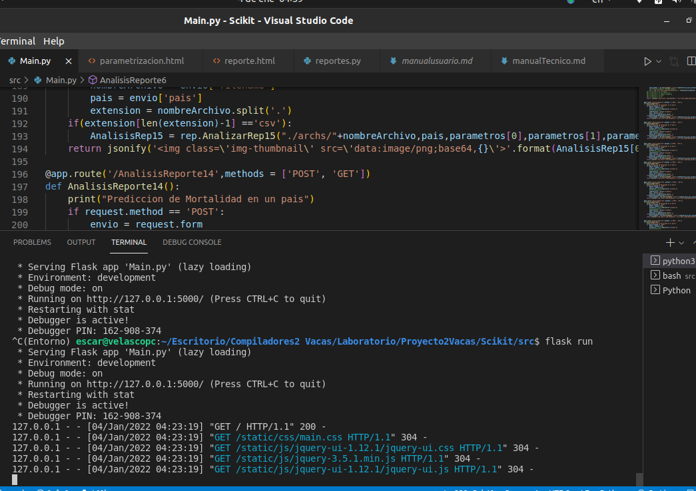
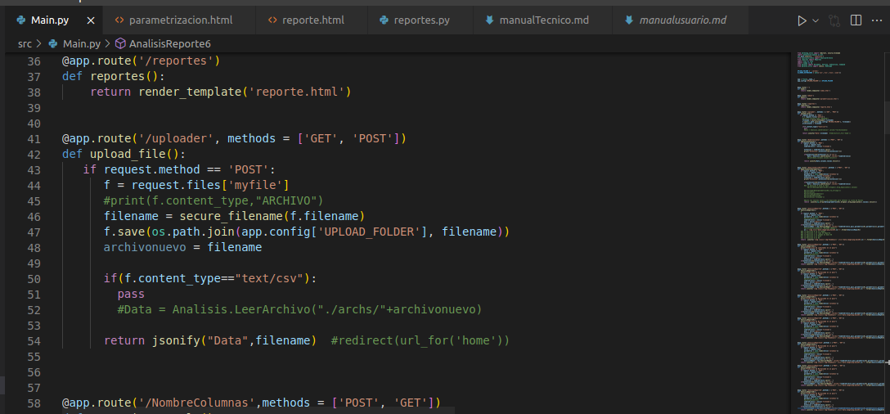
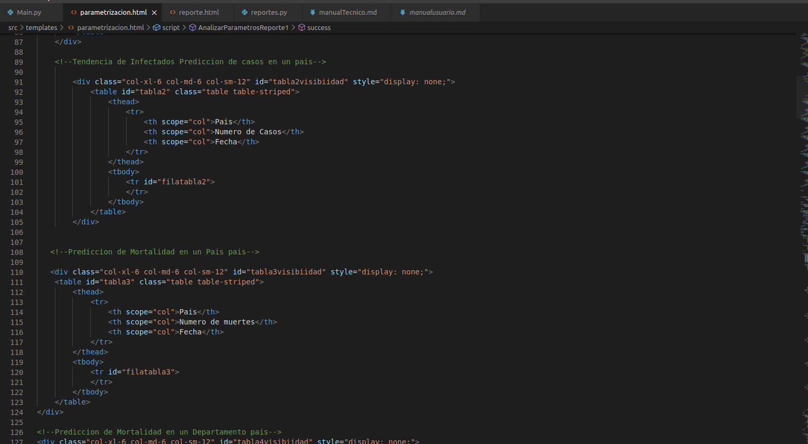
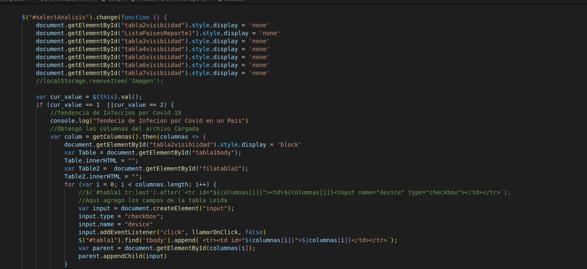
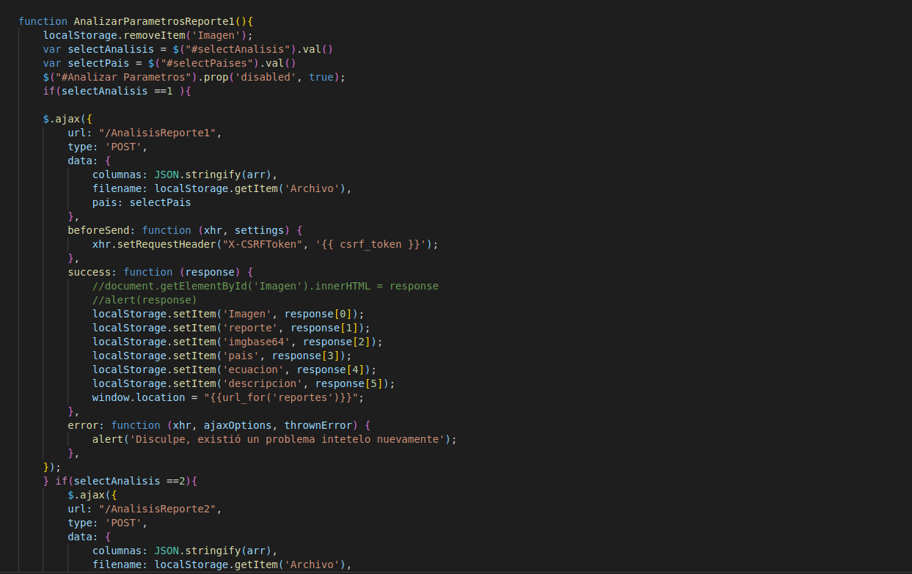
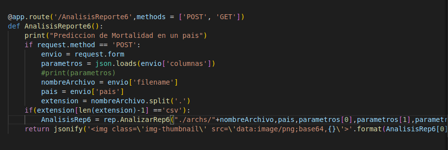
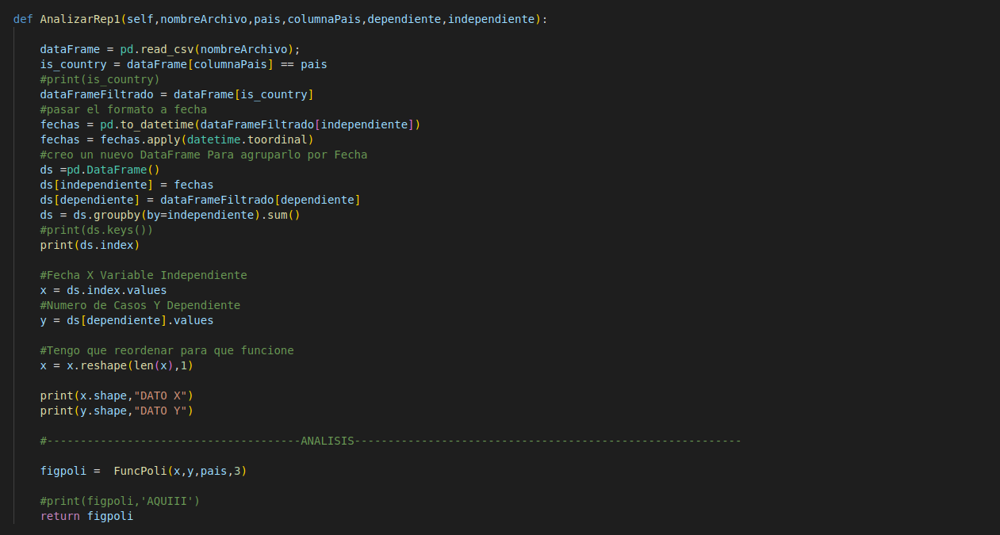
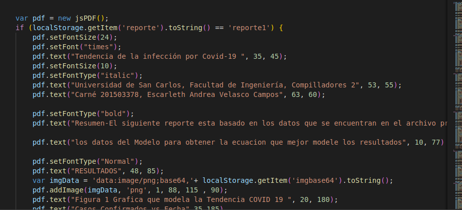

# Manual Tecnico
## Coronavirus Data Analysis With Machine Learning

Es un analizador de datos de la pandemia COVID-19, nuestro objetico principal es analizar los distintos archivos que el usuario proporcina y proporcinal un model de regresion Lineal para modelar los datos y asi poder predecir las tendencias y por analizarlas con mas detalle

Aspectos Tecnicos
- Se utilizo lenguaje Python para desarrollar el backend de la aplicacion
- Se utilizo un entorno virtual virtualenv
- Se utilizo la libreria scikit learn para realizar el analisis de datos
- Se utilzo flask como Api 
- Se desplego la Aplicacion en Heroku https://proyecto2compivacas.herokuapp.com/
- Como frontend se utilizo Javascript

## Instalacion
- Clonar el Repositorio https://github.com/velascoAndrea/Proyect2Compi2Vacas
- Crear un Entorno virtual
- Instalar las librerias necesarisas con pip install
- Posicionar en la carpeta src
- ingresar el comando export FLASK_APP=Main
- Ingresar el comando flask run

## Despliegue en Heroku
- Instalar heroku-cli
- Loguear en heroku heroku login
- crear archivo requirement.txt donde iran todas las librerias que instalemos en nuestro entorno
- crear archivo ProcFile que identificara que archivo levanta la app
- instalar guinivorn (pip install guinicorn)
- crear repositorio git (git add ., git commit -m "first-commit")
- crear app heroku (heroku create nombreproyecto)
- conecta con heroku (heroku git:remote nombreproyecto)
- insertar git push heroku master

## Carga de Archivo al Servidor
Los Archivos que Son Analizados son almacenados en el Servidor para poder tener acceso a ellos cuando lo necesitemoos

## Parametrizacion
Luego que el archivo es almacenado y analizado se procede a parametrizar las variables necesarias para poder realizar el anallisis en este caso en la tabla izquierda se cargan las columnas del archivo que analizamos y en la tabla derecha se colocan los parametros que necesitaremos para el posterior analisis, las tablas se van mostrando con forme las vamos necesitando.

## Analisis
Una vez tenemos los parametros necesarios enviamos una peticion POST por medio de ajax al servidor con los parametros que analizaremos, el sevidor los analizara con la herramienta scikit learn y nos devolvera los datos necesarios para realizar los reportes

## Reportes
Una vez el servidor envia los parametros al frontend se guardan en el localstorage y se re dirige al area de reportes, y ahi se toman los parametros para poder generar nuestro pdf con la herramienta jsPDF.

